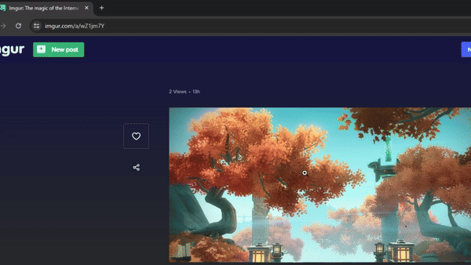
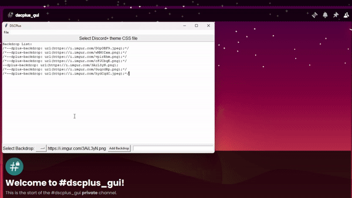

# VCThemeGUI

This is a simple GUI for editing the CSS for specifically editing the **backdrop/background** of modified Discord themes. It allows you to set the backdrop of the current theme by selecting an existing or added url to an image (.png, .jpg, .jpeg, .gif) from the dropdown instead of going into the file yourself and manually editing or commenting out images.

This allows you to more easily store multiple backdrops for the theme and swap between them within a simple interface without having to work within the text css file itself for simpler access.

### -----------------------------------------------------------------------
## How to use:
-  Open the program (VCTheme.exe)
- Go to File → Open in top left corner, then select the theme CSS file for your Discord.
- Use **Select Backdrop** to open dropdown menu so you can swap between existing backdrops
    - Loaded images can also be clicked to select a backdrop instead.
- Use **Add Backdrop** to add new backdrops into the file and Backdrop menu
    - Only supports image/gif links with common appropriate extensions (.png, .jpg, .jpeg, .gif)
         - Can upload a local image to [Imgur](https://imgur.com/upload) or other media sites and copy that image link to be inserted as a backdrop (See GIF examples below)

**Imgur Demo:**

**GUI Demo:**

(Find/upload image → open image in new tab → copy image url for use)

OR

(Find/upload image → copy image address)
   
 
 

**_Currently has support for Vencord's default file directory, others can be found manually_

### -----------------------------------------------------------------------
## Install:
Download the current build **[here](https://github.com/StpME/VCThemeGUI/releases/download/v1.2.0-test/VCTheme.exe)**.

**OR**

Check **[releases](https://github.com/StpME/VCThemeGUI/releases).**
### -----------------------------------------------------------------------

VCThemeGUI is a personal passion project, all credits for themes and clients here:

# [Discord](https://discord.com/download)
## [Discord+](https://plusinsta.github.io/discord-plus/)
## [SoftX](https://betterdiscord.app/theme/SoftX)
### [Vencord](https://vencord.dev/)
### [BetterDiscord](https://betterdiscord.app/)

### This project is not affiliated with Discord or discord.com in any way.
